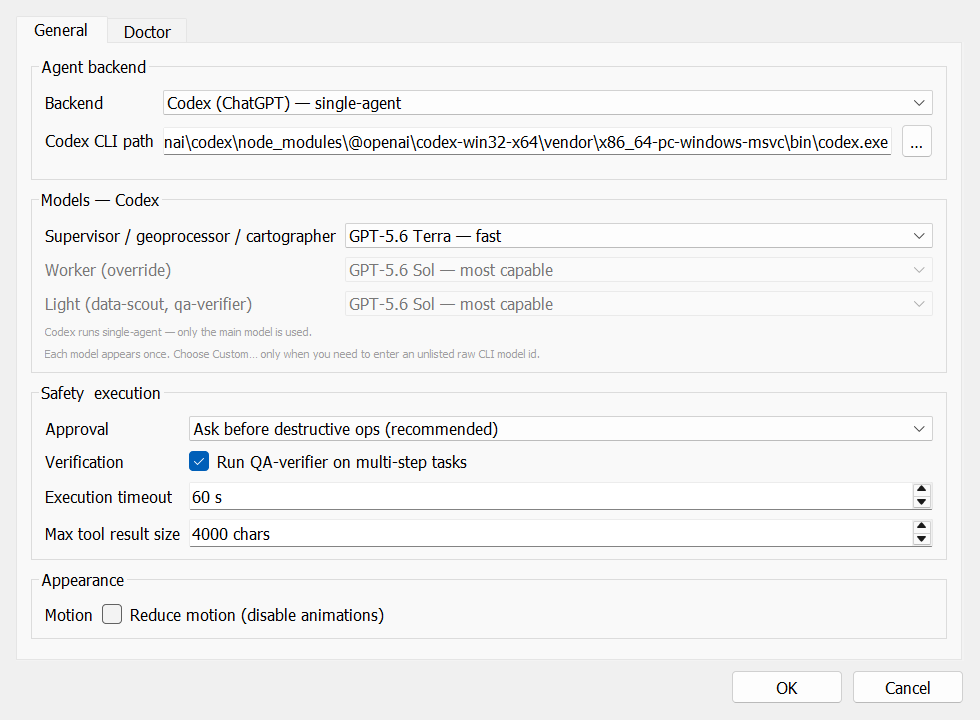
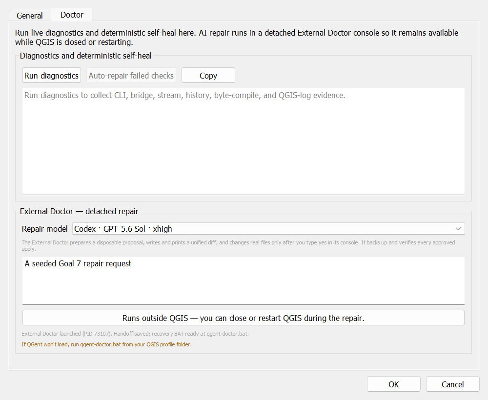

<p align="center">
  
</p>

# QGent — An AI Agent Inside QGIS

<p align="center">
  Turn plain-language GIS requests into live PyQGIS and Processing workflows in your open QGIS project.
</p>

<p align="center">
  
  
  
  
</p>

QGent is an experimental dockable QGIS plugin for AI-assisted GIS work. Ask it
to inspect the current project, transform data, run Processing algorithms,
style layers, build layouts, or export results. QGent executes PyQGIS directly
inside QGIS, streams progress into the chat panel, and pauses for approval
before destructive operations.

It uses an existing **Claude Code** or **Codex** CLI login. You do not place an
API key in the plugin.

## What QGent can do

- Read live project, canvas, CRS, layer, field, selection, and layout context.
- Run multi-step PyQGIS and QGIS Processing workflows from natural language.
- Keep the layer selection attached to a request so the agent uses the layer
  you meant, even if the UI selection changes later.
- Add or style layers, run buffers and overlays, inspect features, create map
  layouts, and export GIS deliverables.
- Require inline approval for file writes, deletes, edit commits, overwrites,
  and other destructive code.
- Restore per-project chat history after QGIS restarts.
- Export a conversation to Markdown or a searchable A4 PDF for project
  documentation and audit trails.
- Verify exported files through a strictly read-only metadata tool before
  reporting success.
- Diagnose common installation and runtime problems through the built-in
  Doctor and the detached, review-gated External Doctor.

Example requests:

```text
What CRS is this project?

Buffer the selected layer by 100 m and add the result.

Apply categorized symbology to landuse using the class field.

Build an A3 vicinity map centred on 14.676, 121.044 with a scale bar,
north arrow, legend, and PDF export.
```

## Screenshots

These screenshots come from QGent's isolated test profile.

| Backend-aware model settings | Detached External Doctor |
|---|---|
|  |  |

## Requirements

- QGIS **3.28 or newer**. The current release was live-tested on QGIS
  **3.44.8** on Windows 11.
- One authenticated CLI:
  - [Claude Code](https://docs.anthropic.com/en/docs/claude-code) with a
    compatible Claude subscription; or
  - [Codex CLI](https://developers.openai.com/codex/cli) with a compatible
    ChatGPT subscription.

Claude Code is the reference backend and supports QGent's specialist agent
team. Codex runs as a single agent with the same live QGIS tools and mandatory
self-verification rules.

## Installation

### Clone into the QGIS plugin folder

Close QGIS, then run this in PowerShell for the default QGIS profile:

```powershell
git clone https://github.com/ljdstechva/qgent.git "$env:APPDATA\QGIS\QGIS3\profiles\default\python\plugins\qgent"
```

Alternatively, download the repository ZIP, extract it, rename the extracted
folder to `qgent`, and place it in:

```text
%APPDATA%\QGIS\QGIS3\profiles\default\python\plugins\qgent
```

Then:

1. Open QGIS.
2. Go to **Plugins → Manage and Install Plugins → Installed**.
3. Enable **QGent**.
4. Open the QGent dock from its toolbar button.
5. Open **Settings** and confirm the detected Claude Code or Codex CLI path.

## Using QGent

1. Open a project and select any layers relevant to your request.
2. Describe the desired result in the QGent composer.
3. Review streamed tool activity and any proposed destructive action.
4. Approve or deny destructive work when prompted.
5. Inspect the resulting layers, map, or exported files in QGIS.

The **New** button starts a clean conversation for the current project. The
export menu beside it writes the persisted conversation as Markdown or PDF.

### Backends

| Backend | Behavior |
|---|---|
| Claude Code | Supervisor plus data-scout, geoprocessor, cartographer, and read-only qa-verifier roles. |
| Codex | Single-agent execution with isolated QGIS-only MCP access and a required self-verification pass. |

QGent keeps model choices separately for each backend. Its Codex invocation
preserves the normal authentication home while suppressing unrelated global
MCP and plugin configuration for the QGent session.

## Safety model

- `execute_pyqgis` payloads are AST-scanned before execution.
- Destructive patterns are routed to the dock's **Approve / Deny** gate.
- The QGIS socket server binds only to `127.0.0.1` and authenticates each
  request with a per-session token.
- PyQGIS work is marshalled onto QGIS's main GUI thread.
- The verifier can inspect export metadata with `stat_path`, but cannot read
  file contents, enumerate directories, or write files through that tool.
- The External Doctor works on a disposable copy, displays a proposed diff,
  and requires an explicit typed confirmation before applying anything.

QGent can still execute powerful code in an open GIS project. Keep the default
**Ask before destructive operations** setting enabled, inspect proposed
changes, and maintain normal backups of important project data.

## Chat history and exports

Conversation history is stored as JSON Lines under the active QGIS profile:

```text
<QGIS settings directory>/qgent/history/<project-key>.jsonl
```

Saved projects use a SHA-256 key derived from the project filename; unsaved
projects use `unsaved.jsonl`. Exports are generated from these persisted
records—not by scraping visible widgets—so a restored conversation exports the
same content as a live one.

## Doctor and recovery

Open **Settings → Doctor** for live diagnostics and deterministic recovery
actions. AI-assisted repair launches in a detached console so it can continue
while QGIS closes or restarts. The workflow creates a disposable proposal,
shows the unified diff, validates the real trees again before apply, creates
paired backups, and verifies hashes and Python compilation afterward.

If QGent cannot load, close QGIS and run:

```text
<QGIS profile>/qgent/qgent-doctor.bat
```

## Architecture

```text
QGIS dock
  ├─ project context + selected-layer tags
  ├─ per-project history + Markdown/PDF export
  └─ authenticated loopback socket
          │
          ▼
  stdlib MCP bridge ──► Claude Code or Codex CLI
          │
          ▼
  main-thread executor ──► PyQGIS / QGIS Processing / live project
```

QGent exposes six coarse MCP tools: `execute_pyqgis`,
`get_project_context`, `run_processing`, `get_layer_features`,
`render_map_snapshot`, and `stat_path`. Coarse calls let an agent complete a
whole GIS step without a large catalogue of fragile, fine-grained tools.

## Repository layout

```text
qgent/
├── agent/              Claude Code and Codex backends
├── bridge/             socket server, safety gate, MCP bridge, executor
├── claude_runtime/     bundled agent rules, specialist roles, and GIS skills
├── context/            live project snapshot construction
├── docs/images/        README screenshots
├── resources/          plugin icon
├── ui/                 chat dock, settings, animations, and widgets
├── doctor*.py          diagnostics and detached recovery workflow
├── export.py           history-to-Markdown/PDF export
├── history.py          per-project JSONL persistence
├── metadata.txt        QGIS plugin metadata
└── plugin.py           QGIS plugin entry point
```

## Privacy

QGent does not ask you to store an API key in the plugin. Prompts, project
context, and data returned through agent tools are sent to the selected model
provider through its authenticated CLI. Review your provider's terms and your
organization's data-handling rules before using confidential or regulated
project information.

## Status and feedback

QGent 0.2.0 is experimental. CLI event formats and flags can change, and the
plugin has not yet been published in the official QGIS plugin repository.

Bug reports and focused feature requests are welcome in
[GitHub Issues](https://github.com/ljdstechva/qgent/issues).
