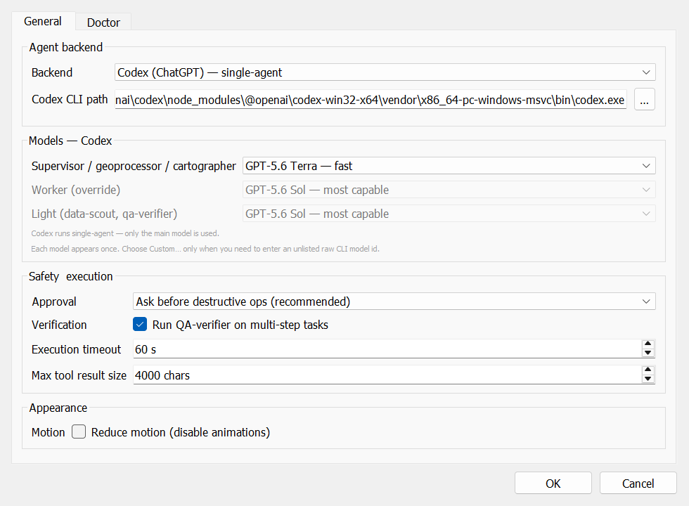
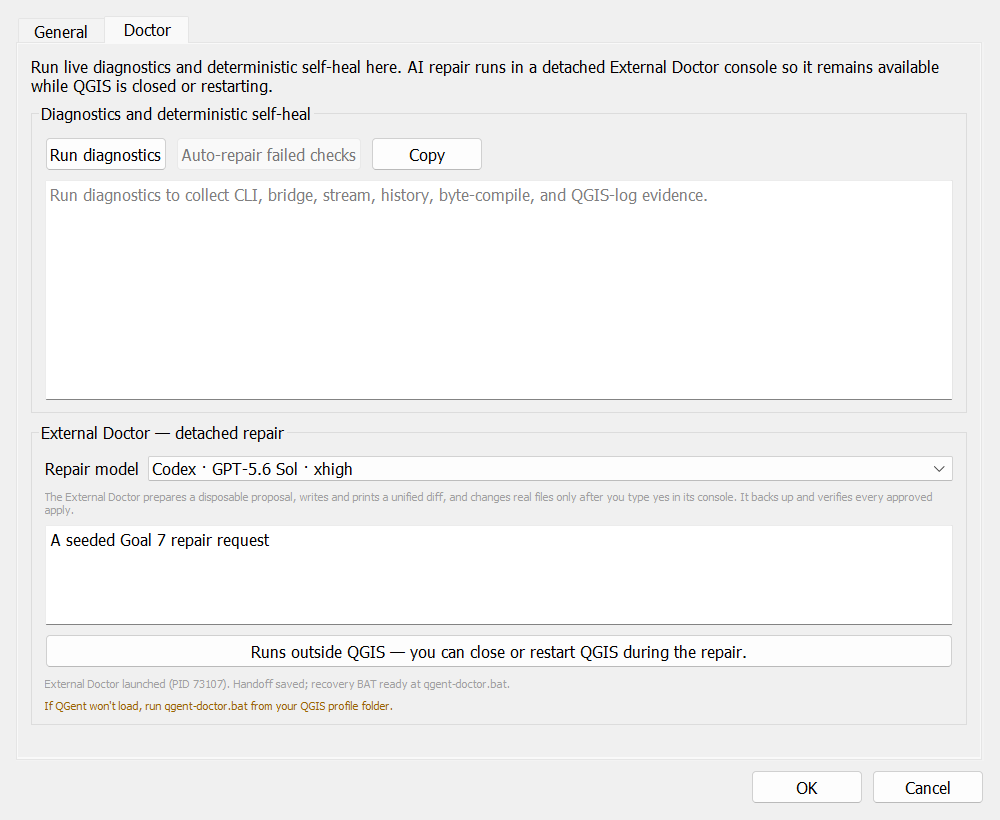

<p align="center">
  
</p>

# QGent — An AI Agent Inside QGIS

<p align="center">
  Turn plain-language GIS requests into live PyQGIS and Processing workflows in your open QGIS project.
</p>

<p align="center">
  
  
  
  
</p>

QGent is an experimental dockable QGIS plugin for AI-assisted GIS work. Ask it
to inspect the current project, transform data, run Processing algorithms,
style layers, build layouts, or export results. QGent executes PyQGIS directly
inside QGIS, streams progress into the chat panel, and pauses for approval
before destructive operations.

It uses an existing **Claude Code** or **Codex** CLI login. You do not place an
API key in the plugin.

## What QGent can do

- Read live project, canvas, CRS, layer, field, selection, and layout context.
- Run multi-step PyQGIS and QGIS Processing workflows from natural language.
- Keep the layer selection attached to a request so the agent uses the layer
  you meant, even if the UI selection changes later.
- Add or style layers, run buffers and overlays, inspect features, create map
  layouts, and export GIS deliverables.
- Work the Layout Manager on its own: design print layouts from page-adaptive
  presets, check them with a design lint and a rendered preview, save them as
  reusable `.qpt` templates in your **User templates** list, and fill a
  template's `[placeholders]` for each new map.
- Turn every question the agent asks — a structured clarification or a
  question left at the end of its reply — into an answerable card, and get
  your attention when QGIS is in the background.
- Require inline approval for file writes, deletes, edit commits, overwrites,
  and other destructive code.
- Restore per-project chat history after QGIS restarts.
- Export a conversation to Markdown or a searchable A4 PDF for project
  documentation and audit trails.
- Verify exported files through a strictly read-only metadata tool before
  reporting success.
- Diagnose common installation and runtime problems through the built-in
  Doctor and the detached, review-gated External Doctor.

Example requests:

```text
What CRS is this project?

Buffer the selected layer by 100 m and add the result.

Apply categorized symbology to landuse using the class field.

Build an A3 vicinity map centred on 14.676, 121.044 with a scale bar,
north arrow, legend, and PDF export.

Design an A3 landscape template for flood hazard maps and save it to my
Layout Manager.
```

## Screenshots

These screenshots come from QGent's isolated test profile.

| Backend-aware model settings | Detached External Doctor |
|---|---|
|  |  |

## Requirements

- QGIS **3.28 or newer**. The current release was live-tested on QGIS
  **3.44.8** on Windows 11.
- One authenticated CLI:
  - [Claude Code](https://docs.anthropic.com/en/docs/claude-code) with a
    compatible Claude subscription; or
  - [Codex CLI](https://developers.openai.com/codex/cli) with a compatible
    ChatGPT subscription.

Claude Code is the reference backend and supports QGent's specialist agent
team. Codex runs as a single agent with the same live QGIS tools and mandatory
self-verification rules.

## Installation

### Clone into the QGIS plugin folder

Close QGIS, then run this in PowerShell for the default QGIS profile:

```powershell
git clone https://github.com/ljdstechva/qgent.git "$env:APPDATA\QGIS\QGIS3\profiles\default\python\plugins\qgent"
```

Alternatively, download the repository ZIP, extract it, rename the extracted
folder to `qgent`, and place it in:

```text
%APPDATA%\QGIS\QGIS3\profiles\default\python\plugins\qgent
```

Then:

1. Open QGIS.
2. Go to **Plugins → Manage and Install Plugins → Installed**.
3. Enable **QGent**.
4. Open the QGent dock from its toolbar button.
5. Open **Settings** and confirm the detected Claude Code or Codex CLI path.

## Using QGent

1. Open a project and select any layers relevant to your request.
2. Describe the desired result in the QGent composer.
3. Review streamed tool activity and any proposed destructive action.
4. Approve or deny destructive work when prompted.
5. Inspect the resulting layers, map, or exported files in QGIS.

The **New** button starts a clean conversation for the current project. The
export menu beside it writes the persisted conversation as Markdown or PDF.

### Backends

| Backend | Behavior |
|---|---|
| Claude Code | Supervisor plus data-scout, geoprocessor, cartographer, and read-only qa-verifier roles. |
| Codex | Single-agent execution with isolated QGIS-only MCP access and a required self-verification pass. |

QGent keeps model choices separately for each backend. Its Codex invocation
preserves the normal authentication home while suppressing unrelated global
MCP and plugin configuration for the QGent session.

## Layout templates

QGent drives print layouts through two tools instead of ad-hoc PyQGIS:

- `layout_info` (read-only) lists layouts and every template QGIS can see,
  describes a layout or `.qpt` with a design lint (clipped text, overflowing
  legends or tables, items off the page or on the map's grid labels, overlaps,
  unfilled placeholders), and renders a page to PNG. Previews appear in the
  chat.
- `manage_layouts` builds a layout from a JSON spec or a preset
  (`side_panel`, `title_strip`, `report_figure`; A6–A0, Letter, ANSI, Arch),
  saves it as a template, instantiates templates with `[placeholder]` fill
  and map overrides, exports PDF/PNG/SVG, and opens the Layout Designer.

Templates are saved to `<QGIS profile>/composer_templates`, so they appear
under **Project ▸ Layout Manager ▸ User templates**. Their `[Map Title]`-style
placeholders follow the same convention as the Map Template Builder plugin.
Replacing a layout, overwriting a template or export, and deleting a layout
all require your approval.

## Questions from the agent

When the agent needs a decision it asks through `ask_user`, which QGent shows
as a card with choices. If a reply instead ends with a question ("Should I
export it as PDF or PNG?"), QGent detects it and shows the same kind of card,
with buttons for listed options, either/or choices, or yes/no. Clicking a
choice or typing in the composer sends your reply. A question that is still
open when QGIS restarts stays answerable. If QGIS is in the background, the
dock is raised and QGIS flashes in the taskbar.

## Updates and new models

QGent checks for updates in the background after startup and once per day
while QGIS remains open. Open **Settings → Updates** or
**Plugins → QGent → Check for updates…** for an immediate check. The Updates
tab also lets you disable automatic checks (save with **OK**) or dismiss the
current notifications; a later release or newly detected model is still reported.

**General → Models → Refresh models** updates the dropdowns immediately.
Successful background checks do the same. Claude's current alias labels (for
example, the installed CLI's current Sonnet and Opus versions) and both backends'
new model choices are saved in your QGIS profile and restored after restarting.
Your selected models and unsaved edits stay as selected; you can choose a newly
listed model under **Advanced** without typing a raw ID.

Checks compare QGent's installed version against `metadata.txt` on this
repository's `main` branch and Claude Code/Codex versions against their latest
stable GitHub releases. Selectable models come from `codex debug models` and
Claude Code's Agent SDK initialization response, without sending a prompt.
The Claude metadata process disables hooks, plugins, MCP servers and tools.
Only these structured catalogs update the dropdowns; unconfirmed binary strings
and release-note mentions remain informational. Hidden Codex entries are excluded.
If a CLI cannot provide its catalog, QGent keeps the last saved choices and shows
the error. Discovery does not guarantee account access. **Custom…** remains
available for an explicitly chosen raw model ID.

The feature notifies you and links to installation/release instructions; it
does not install software or change your selected models. Checks make public
requests to GitHub and use the installed CLI for model discovery, without a
paid model request. Results and dismissals are saved under the QGIS profile's
`qgent/updates.json`. Network failures are shown and logged; automatic checks
retry after an hour. Updating QGent or either CLI invalidates cached results.

For a QGent update, close QGIS, back up the existing plugin folder, then follow
the [installation instructions](#installation) to replace that folder with the
new version (or pull this repository if installed with Git). Reopen QGIS and
check **Settings → Updates**. Claude Code and Codex release links are provided
in the same tab for their own installation methods.

## Safety model

- `execute_pyqgis` payloads are AST-scanned before execution.
- Destructive patterns are routed to the dock's **Approve / Deny** gate.
- The QGIS socket server binds only to `127.0.0.1` and authenticates each
  request with a per-session token.
- PyQGIS work is marshalled onto QGIS's main GUI thread.
- The verifier can inspect export metadata with `stat_path`, but cannot read
  file contents, enumerate directories, or write files through that tool.
- The External Doctor works on a disposable copy, displays a proposed diff,
  and requires an explicit typed confirmation before applying anything.

QGent can still execute powerful code in an open GIS project. Keep the default
**Ask before destructive operations** setting enabled, inspect proposed
changes, and maintain normal backups of important project data.

## Chat history and exports

Conversation history is stored as JSON Lines under the active QGIS profile:

```text
<QGIS settings directory>/qgent/history/<project-key>.jsonl
```

Saved projects use a SHA-256 key derived from the project filename; unsaved
projects use `unsaved.jsonl`. Exports are generated from these persisted
records—not by scraping visible widgets—so a restored conversation exports the
same content as a live one.

## Doctor and recovery

Open **Settings → Doctor** for live diagnostics and deterministic recovery
actions. AI-assisted repair launches in a detached console so it can continue
while QGIS closes or restarts. The workflow creates a disposable proposal,
shows the unified diff, validates the real trees again before apply, creates
paired backups, and verifies hashes and Python compilation afterward.

If QGent cannot load, close QGIS and run:

```text
<QGIS profile>/qgent/qgent-doctor.bat
```

## Architecture

```text
QGIS dock
  ├─ project context + selected-layer tags
  ├─ per-project history + Markdown/PDF export
  └─ authenticated loopback socket
          │
          ▼
  stdlib MCP bridge ──► Claude Code or Codex CLI
          │
          ▼
  main-thread executor ──► PyQGIS / QGIS Processing / live project
```

QGent exposes nine coarse MCP tools: `execute_pyqgis`,
`get_project_context`, `run_processing`, `get_layer_features`,
`render_map_snapshot`, `stat_path`, `layout_info`, `manage_layouts`, and
`ask_user`. Coarse calls let an agent complete a whole GIS step without a
large catalogue of fragile, fine-grained tools.

## Repository layout

```text
qgent/
├── agent/              Claude Code and Codex backends
├── bridge/             socket server, safety gate, MCP bridge, executor
├── claude_runtime/     bundled agent rules, specialist roles, and GIS skills
├── context/            live project snapshot construction
├── docs/images/        README screenshots
├── resources/          plugin icon
├── ui/                 chat dock, settings, animations, and widgets
├── doctor*.py          diagnostics and detached recovery workflow
├── export.py           history-to-Markdown/PDF export
├── history.py          per-project JSONL persistence
├── metadata.txt        QGIS plugin metadata
└── plugin.py           QGIS plugin entry point
```

## Privacy

QGent does not ask you to store an API key in the plugin. Prompts, project
context, and data returned through agent tools are sent to the selected model
provider through its authenticated CLI. Review your provider's terms and your
organization's data-handling rules before using confidential or regulated
project information.

## Status and feedback

QGent 0.4.0 is experimental. CLI event formats and flags can change, and the
plugin has not yet been published in the official QGIS plugin repository.

Bug reports and focused feature requests are welcome in
[GitHub Issues](https://github.com/ljdstechva/qgent/issues).
